# Full Brain Neuron Fragment 2D Discrete Morse Graph Reconstruction Python Package

* [Introduction](#introduction)
* [Installation Intructions](#installation-instructions)
  * [System Requirements](#system-requirements)
  * [Required Python Libraries](#required-python-libraries)
  * [Compiling Code](#compiling-code)
  * [MATLAB Scripts](#matlab-scripts)
* [DiMo2D Functions](#dimo2d-functions)
* [Separate Programs](#separate-programs)
* [MATLAB Scripts](#matlab-scripts)
* [Example Use of Pipeline](#example-use-of-pipeline)
* [Test Data](#test-data)

## Introduction

DiMo2d is a python package (with underlying matlab functions and c++ libraries) that can be extract in-plane neuronal fragments for process detection outputs of mouse brain image stacks.  There are functions for computing persistence computing persistence diagram for each process detection likelihood output image (required for computing DM graph reconstruction, but could also be of independent interest), computing DM graph reconstruction for image, postprocessing graph of each image to extract fragments, and writing graphs to various formats, such as geojson to be posted to CSHL brain viewer or .vtp format to be visualize by applications such as paraview (https://www.paraview.org/).

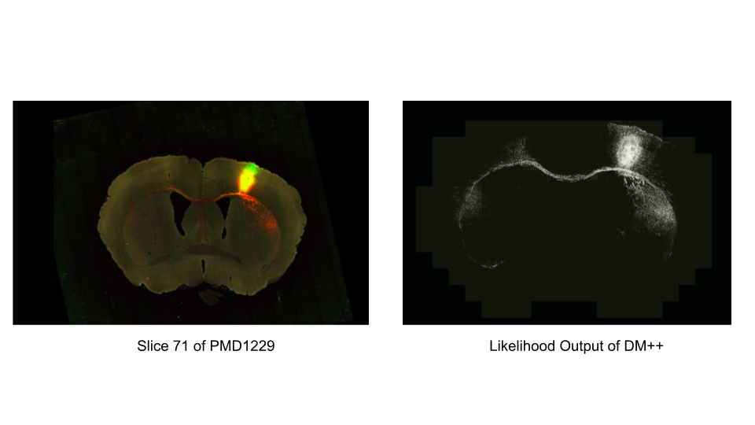

DM graph reconstruction is a methodology used to extract true underlying graph structure behind noisy input data. The input for the algorithm is a density function defined on a triangulation, and the output graph is the mountain ridges of the input density function. For mouse brain process detection images, the density function used is simply the pixel values. The mountain ridges of the density function do an excellent job of capturing the neuronal branches in each image. After some postprocessing, the graph is able to extract individual neuron fragments in an image.  Applying to a full mouse brain image stack allows to capture all fragments in mouse brain projected into 2D planes.

This package was designed to be an intergral part of the pipeline to extract individual neurons from sparse mouse brain image stacks (images are very far apart compared to inplane pixels). While the pipeline will output a graph capture all neuronal fragments in each plane, further methodology for tying together fragments across planes is required.

## Installation Instructions

Copy DiMo2d to your current working directory, then ensure all system requirements and python libraries are installed.  Then compile c++ programs that the library calls, and copy matlab functions to the current working directory.  See below for specific instructions.

### System Requirements
- Python 3.8.8 (or newer)
- g++ 9.4.0 (or newer)
- cmake 3.16.3 (or newer)

### Required Python Libraries

- cv2 (https://pypi.org/project/opencv-python/)

    >pip install opencv-python

- PIL (https://pypi.org/project/Pillow/)

    >pip install pillow 

- geojson (https://pypi.org/project/geojson/)

    >pip install geojson

- vtk (https://pypi.org/project/vtk/)

    >pip install vtk

### Compiling Code

Dipha Persistence Module

    > cd ./DiMo2d/code/dipha-2d-thresh/
    > mkdir build
    > cd build
    > cmake ../
    > make

Discrete Morse Graph Reconstruction Module

    > cd ./DiMo2d/code/dipha-output-2d-ve-et-thresh/
    > g++ ComputeGraphReconstruction.cpp
    
### MATLAB Scripts

    > cp ./DiMo2d/code/matlab/* ./

## DiMo2d Functions

### DiMo2d.compute_persistence_single_channel(input_dir, output_dir, threads=1)

#### Description

The first step of compute DM graph reconstruction to compute the persistence diagrams of each likelihood image. This packages uses a modified version of the DIPHA software for this computation. DIPHA takes specifically formatted input file. After generating the input files for the dipha program for each image (DiMo2d.write_dipha_persistence_input) this function will call the DIPHA program to compute the persistence diagram for each image, and convert the output to a format readable by the DM graph reconstruction program.

#### Input
- input_dir - Directory containing stack of DM++ likelihood output tifs
- output_dir - Directory where results will be stored.  
- threads - number of threads used to run in parallel

####	Output
Each 2D slice will have its own subdirectory in output_dir named by slice name.  All files required for input be discrete Morse graph reconstruction program will be found in the subdirectories.

#### Example:

    > import DiMo2d as dm
	
    > likelihood_dir = “data/likelihood/”
    > morse_dir = “results/likelihood-morse/”
    > dm.compute_persistence_single_channel(likelihood_dir, morse_dir)
    

### DiMo2d.generate_morse_graphs(input_path, binary_dir, ve_persistence_threshold=0, et_persistence_threshold=64,  threads=1)

#### Description

Run discrete Morse graph reconstruction on each likelihood image within input_path directory. Traditionally, the algorithm has one parameter - a persistence threshold.  The higher the threshold the more simplified the output.  However, due to the natural of the data, we allow for 2 different persistence threshold - a negative (ve) threshold and a positive (et) threshold to allow for different threshold of negative features (connected components) and positive features (loops) in the graph.  Applying the binary segmentation output to the morse graphs gives output graphs that lie only in regions where neuronal process is detected.

#### Input
- input_path - directory containing results for each slice.  This should be the same as output_dir in a DiMo2d.compute_persistence_single_channel call
binary_dir - path to directory containing the DM++ binary outputs for each slice
- ve_persistence_threshold - negative critical edge persistence threshold
- et_persistence_threshold - positive critical edge persistence threshold.  This must be greater than or equal to ve_persistence_threshold
- threads - number of threads used to run in parallel

#### Output
Morse Graph for each image with specified persistence thresholds

#### Example:

    > import DiMo2d as dm
	
    > likelihood_dir = “data/likelihood/”
    > morse_dir = “results/likelihood-morse/”
    > dm.compute_persistence_single_channel(likelihood_dir, morse_dir)
    > dm.generate_morse_graphs(morse_dir, binary_dir, 0, 64)

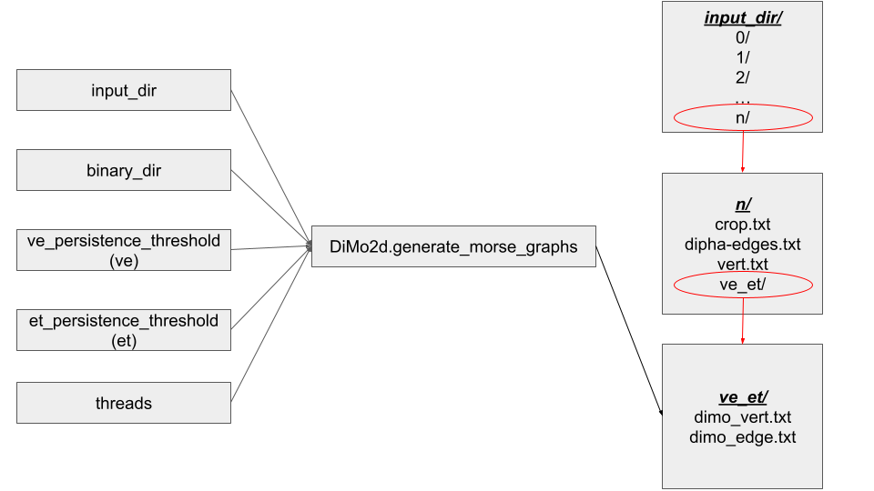

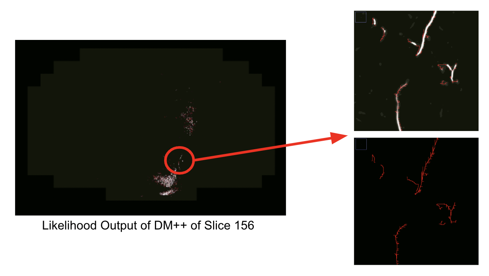

### DiMo2d.postprocess_graphs(input_path, ve_persistence_threshold=0, et_persistence_threshold=64, threads=1)

#### Description

This function further postprocesses the graphs of each image to better capture the individual neuron fragments in each plane.  Specifically, be nature of masking the DM graphs with the binary segmentation outputs, the graphs will capture the fragments but have additional "hairs" - straight line paths to leaves off of the actual fragments.  This function will remove the erroneous extra branches from the true neuron fragments.

#### Input
- input_path - directory containing results for each slice.  This should be the same as input_path in a DiMo2d.generate_morse_graphs call.
- ve_persistence_threshold - negative critical edge persistence threshold
- et_persistence_threshold - positive critical edge persistence threshold
threads - number of threads used to run in parallel

####	Output
Perform postprocessing of graph at specified thresholds of each image.

#### Example:

    > import DiMo2d as dm
	
    > likelihood_dir = “data/likelihood/”
    > morse_dir = “results/likelihood-morse/”
    > dm.compute_persistence_single_channel(likelihood_dir, morse_dir)
    > dm.generate_morse_graphs(morse_dir, binary_dir, 0, 64)
    > dm.postprocess_graphs(morse_dir, 0, 64)
    
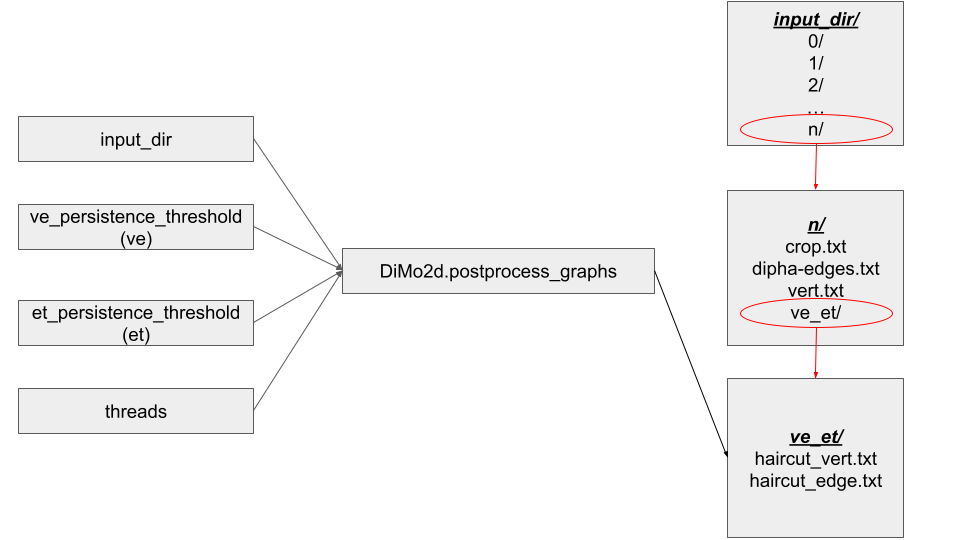

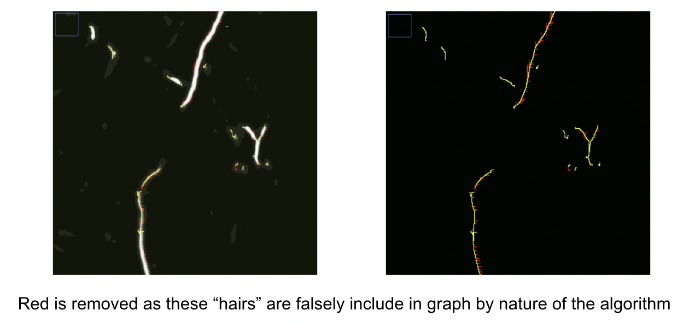

### DiMo2d.cshl_post_results(input_path, output_dir, ve_persistence_threshold=0, et_persistence_threshold=64, threads=1)

#### Description

For datasets that have been posted to CSHL brain viewer (http://www.braincircuits.org/viewer4/mouse/map/2293), results can be posted to web and overlaid on top of original data and segmentation result.  This function produces a geojson file of each graph that if moved to the appropriate directory can be visualized by the viewer.

####	Input

- input_path - directory containing results for each slice.  This should be the same as input_path in a previous DiMo2d.postprocess_graphs call.
- output_dir - directory results will be stored
- ve_persistence_threshold - negative critical edge persistence threshold
- et_persistence_threshold - positive critical edge persistence threshold
- threads - number of threads used to run in parallel

####	Output

Geojson ready to be posted to CSHL webviewer is written for each slice

#### Example:
    
    >import DiMo2d as dm

    >likelihood_dir = “data/likelihood/”
    >binary_dir = “data/binary/”
    >morse_dir = “results/likelihood-morse/”
    >json_dir = “results/post_to_web/”
    >dm.compute_persistence_single_channel(likelihood_dir, morse_dir)
    >dm.generate_morse_graphs(morse_dir, binary_dir, 0, 64)
    >dm.postprocess_graphs(morse_dir, 0, 64)
    >dm.cshl_post_results(morse_dir, json_dir, 0, 64)
    
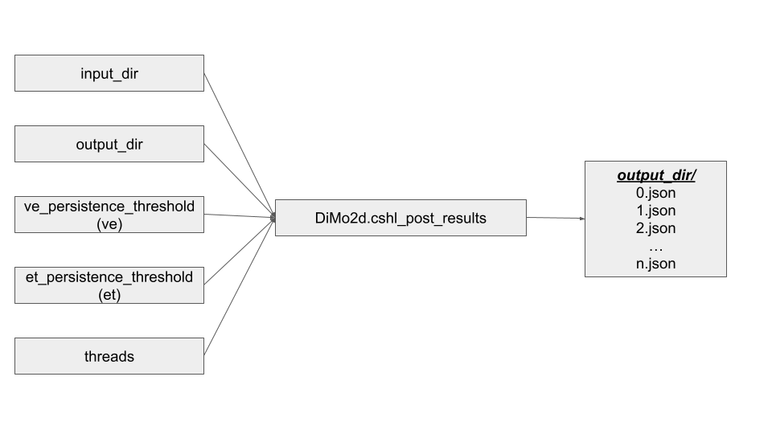

### DiMo2d.write_vtp_graph(input_dir, output_filename, ve_persistence_threshold=0, et_persistence_threshold=64)

#### Description

Convert .txt format graph (vert file and edge file) to .vtp format. Through the package, DM graphs are outputted as two .txt files - a text file for vertices and a text file for edges. Different formatting is required to visualize graphs in 3rd party software. This function will output a .vtp file for the specified input graph. .vtp can be viewed in softwares such as Paraview.

#### Input

- input_dir - directory containing results for each slice.  This should be the same as input_path in a previous DiMo2d.postprocess_graphs call
- output_filename - name of vtp file output will be written to
- ve_persistence_threshold - negative critical edge persistence threshold
- et_persistence_threshold - positive critical edge persistence threshold

#### Output

A single file (output_filename) written in .vtp format containing graphs of each slice

Example:

    >import DiMo2d as dm

    >likelihood_dir = “data/likelihood/”
    >binary_dir = “data/binary/”
    >morse_dir = “results/likelihood-morse/”
    >vtp_filename = “results/full_brain.vtp”
    >dm.compute_persistence_single_channel(likelihood_dir, morse_dir)
    >dm.generate_morse_graphs(morse_dir, binary_dir, 0, 64)
    >dm.postprocess_graphs(morse_dir, 0, 64)
    >dm.write_vtp_graph(morse_dir, vtp_filename, 0, 64)
    

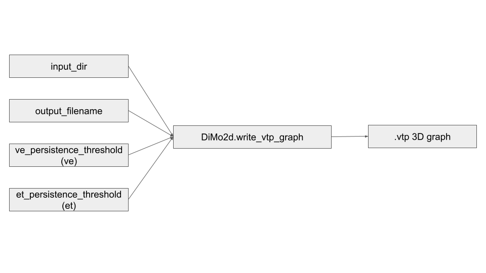

## Separate Programs

### Dipha Persistence Program (code/dipha-2d-thresh/build/dipha)

#### Description
The first step of the DM graph reconstruction algorithm is to compute persistence on the so called lower star filtration of the input triangulation with respect to the density function. This package uses the state of the art DIPHA persistence program for this step. The program is a modified version of the code found at (https://github.com/DIPHA/dipha) that is meant to explicitly take 2D data, compute persistence on regions of an image with > 31 pixel value - the minimal likelihood pixel value assigned by DM++ - and output all of the persistence information needed for the DM graph reconstruction algorithm.

#### Python Function

DiMo2d.compute_persistence_single_channel

#### Input
- input_filename - path to DIPHA input file
- output_filename - filename for traditional DIPHA program persistence diagram
- edge_filename - filename for edge information - vertices, edge type (negative or positive), and persistence value
- nx - x axis size of image
- ny - y axis size of image

#### Output:

Binary file (edge_filename) contained persistence information for all edges

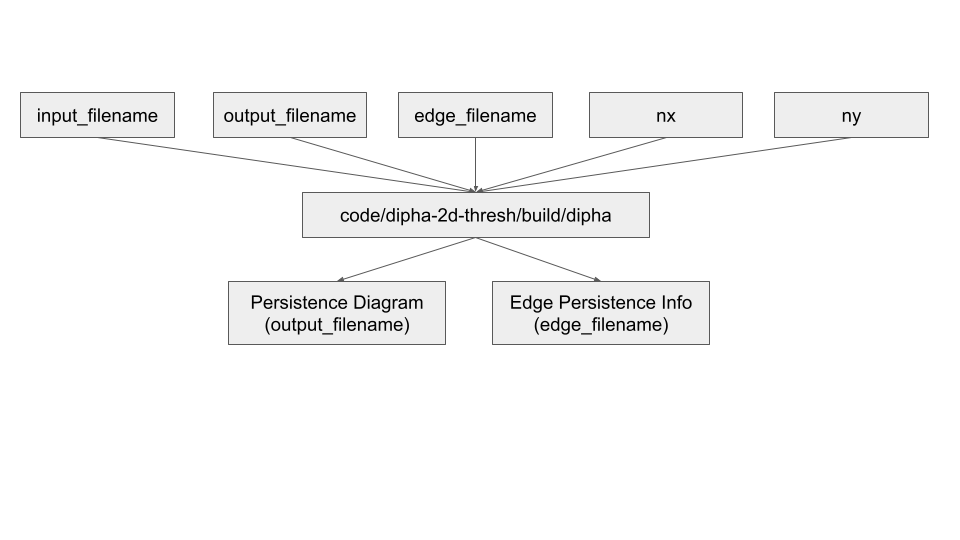

### Discrete Morse Graph Reconstruction Program (code/dipha-output-2d-ve-et-thresh/a.out)

#### Description

After computing persistence of the edges in the domain, the DM algorithm uses the persistence information to build an appropriate spanning forest and extracts the stable 1-manifolds (mountain ridges) on top of the spanning forest. The program takes a list of vertices in the domain and a file containing the persistence information computed by DIPHA.

#### Python Function

DiMo2d.generate_morse_graphs

#### Input

- vert_filename - file contain verts in domain
- dipha_edge_filename - .txt format of edge persistence information
- ve_persistence threshold - persistence threshold for negative edges
- et_persistence threshold - persistence threshold for positive edges
- output_dir - directory where output graph will be written

#### Output

Graph (dimo_vert.txt and dimo_edge.txt) written to output_dir

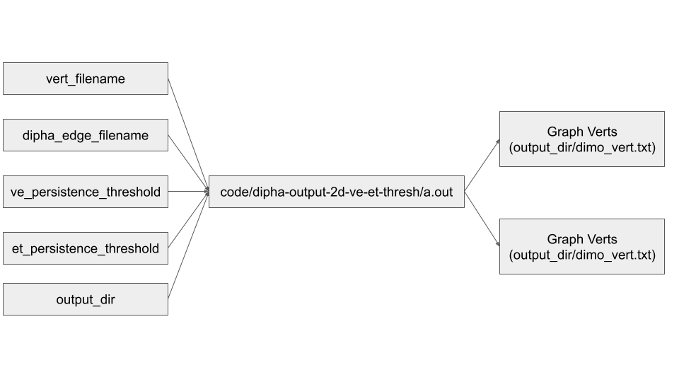

## MATLAB Scripts

The following matlab scripts were taken from (https://github.com/DIPHA/dipha).

### save_image_data.m

#### Description

Creates DIPHA input file for all subregions. The DIPHA program takes a specifically formatted input file. The authors of DIPHA included a script for generating such file for imaging data. This is the same script.

#### Python Function

DiMo2d.compute_persistence_single_channel

#### Input

- input_filename - input path to image
- filename - path dipha input file will be written to

#### Output
DIPHA input file for an image

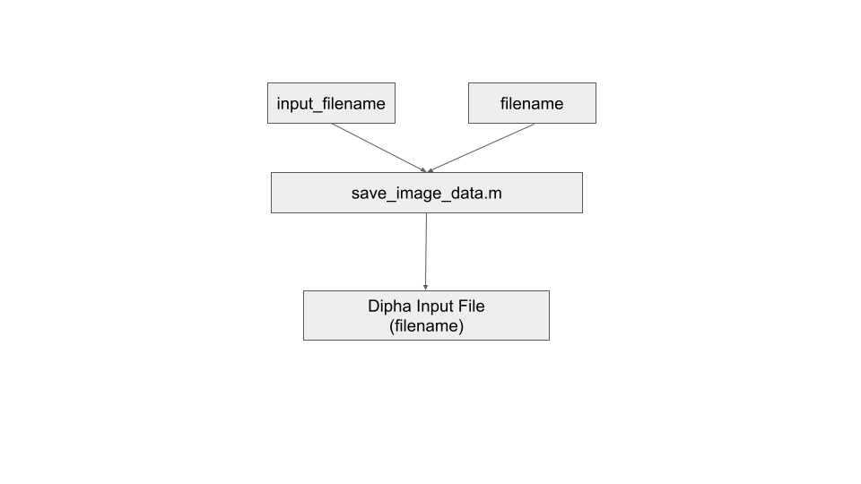

### load_persistence_diagram.m

#### Description

Converts DIPHA persistence diagram to .txt format for use by Discrete Morse Graph Reconstruction program. The DIPHA program includes a matlab function to read in binary output file of program to visualize persistence diagram. This matlab function is a modified version meant to convert the dipha output of a likelihood image into a usable format for the DM-graph reconstruction program.

#### Python Function
		
DiMo2d.compute_persistence_single_channel

#### Input
- input_filename - Persistence diagram output directly from DIPHA program (.bin format)
- output_filename - filename for .txt format of persistence diagram

#### Output

Persistence Diagram in .txt format for each likelihood image

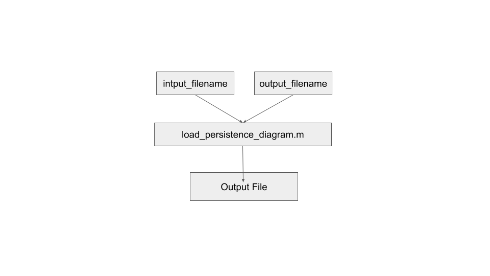

## Example Use of Pipeline

    > import DiMo2d as dm

    >likelihood_dir = “data/likelihood/”
    >binary_dir = “data/binary/”
    >morse_dir = “results/likelihood-morse/”
    >json_dir = “results/post_to_web/”
    >ve_thresh = 0
    >et_thresh = 64
    >threads = 4
    >dm.compute_persistence_single_channel(likelihood_dir, morse_dir, threads)
    >dm.generate_morse_graphs(morse_dir, binary_dir, 0, 64, threads)
    >dm.postprocess_graphs(morse_dir, 0, 64, threads)
    >dm.cshl_post_results(morse_dir, json_dir, 0, 64, threads)

## Test Data

Included in the data folder is are two directorys - one containing the likelihood images and the other containing the binary segmentation images of DM++ on two PMD 1229 slice.  Results can be viewed here (http://www.braincircuits.org/viewer4/mouse/map/2293).  The slices included are 0156 and 0156.
